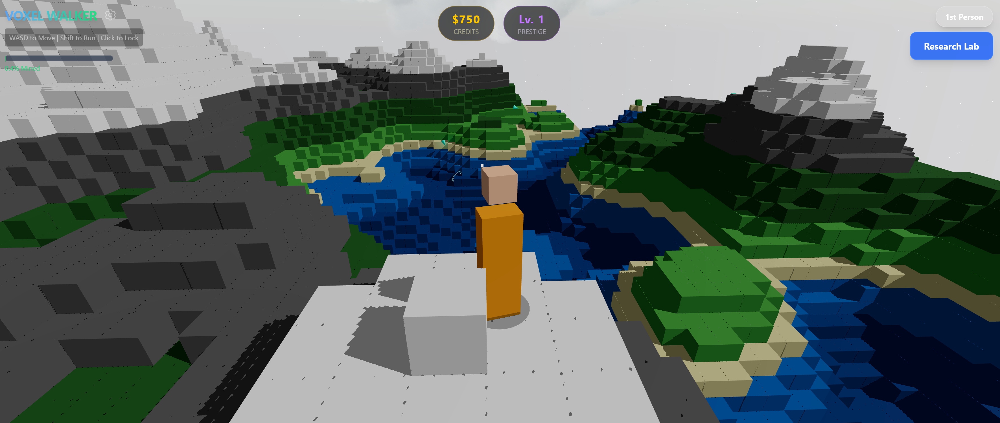

# NanoBotsIdle (Voxel Walker)

A 3D Voxel Incremental/Idle game built with React Three Fiber. Command a fleet of autonomous mining drones to strip-mine procedurally generated planets, research upgrades, and warp to new worlds.



## 🎮 Controls

| Key            | Action                                   |
| -------------- | ---------------------------------------- |
| **W A S D**    | Move Player                              |
| **Space**      | Jump                                     |
| **Shift**      | Sprint                                   |
| **Click**      | Lock Mouse (Camera Control)              |
| **UI Buttons** | Toggle View (1st/3rd), Open Research Lab |

## 🌟 Features

### 🤖 Autonomous Drone Fleet

- Drones automatically seek valuable voxel blocks.
- Visual mining lasers and particle effects.
- **Upgradable AI:** Increase fleet size, mining speed, and thruster velocity.

### 🪐 Procedural Voxel Worlds

- Infinite (pseudo-infinite via prestige) procedural terrain generation.
- Destructible environment: Drones physically remove blocks from the world.
- Different biomes/height maps based on prestige seed.

### 🔬 Research & Progression

- **Credits:** Earned by mining blocks.
- **Upgrades:**
  - **Drone Count:** Expand your swarm.
  - **Drill Speed:** Mine blocks faster.
  - **Thrusters:** Reduce travel time between blocks.
  - **Laser Power:** Visual intensity upgrades.
- **Prestige (Planetary Jump):** Warp to a new, fresh planet when resources run low. Increases global resource multipliers.

### 🎥 Dual Camera Modes

- **First Person:** Immersive view for exploring the mines.
- **Third Person:** Tactical view of your character and the drone swarm.

## 🛠️ Tech Stack

- **Core:** React, TypeScript, Vite
- **3D Engine:** Three.js, @react-three/fiber, @react-three/drei
- **State Management:** Zustand
- **Styling:** TailwindCSS
- **Physics/Math:** Custom voxel collision & Simplex noise

## 🚀 Getting Started

1. **Install dependencies:**
   ```bash
   npm install
   ```
2. **Start development server:**
   ```bash
   npm run dev
   ```
3. **Build for production:**
   ```bash
   npm run build
   ```

## 🐛 Debugging & Logging

This project uses a centralized logger utility (`src/utils/logger.ts`) for consistent logging across the codebase.

### Logger Usage

The logger provides environment-aware logging methods that:

- **Development:** Display debug logs in the browser console
- **Production:** Strip all debug logs from the build (only errors remain)

```typescript
import { debug, info, warn, error } from "@/utils/logger";

// Debug logs (development only)
debug("Player position:", { x, y, z });

// Info logs (development only)
info("Drone started mining block");

// Warning logs (development only)
warn("Low credit balance");

// Error logs (always visible)
error("Failed to load configuration:", err);
```

### Runtime Debug Toggle

In development, you can toggle debug logging at runtime via the browser console:

```javascript
// Enable debug logging
import { enableDebug } from "./src/utils/logger";
enableDebug();

// Disable debug logging
import { disableDebug } from "./src/utils/logger";
disableDebug();

// Check debug status
import { isDebugEnabled } from "./src/utils/logger";
console.log(isDebugEnabled());
```

### ESLint Rule

Direct `console.*` usage is prohibited in `src/` to ensure consistent logging. Use the logger utility instead.
Exceptions: tests, scripts, workers, and the logger utility itself.

## 🧪 Testing & Quality

### Running Tests

```bash
# Run all tests
npm test

# Run tests in watch mode
npm run test:watch

# Run lifecycle/memory leak tests specifically
npm run test:lifecycle
```

### Memory Profiling

NanoBotsIdle includes comprehensive memory leak detection and profiling tools to ensure long-running sessions remain stable:

```bash
# Generate baseline memory profile
npm run profile:baseline
```

For detailed profiling guidance and leak detection, see [dev/profiling/README.md](dev/profiling/README.md).

**What's tested:**

- Chunk load/unload cycles don't accumulate unbounded state
- Worker termination properly cleans up event handlers
- InstancedMesh updates don't leak Three.js object references
- Repeated meshing operations maintain stable memory usage

### Code Quality

```bash
# Lint code
npm run lint

# Fix linting issues
npm run lint:fix

# Type check
npm run typecheck

# Format code
npm run format
```

## 💾 Save Data & Migrations

### Save Format

NanoBotsIdle uses a versioned save schema to ensure backward compatibility as the game evolves. All saves follow this structure:

```json
{
  "version": 2,
  "date": "2024-12-30T15:45:00.000Z",
  "data": {
    "credits": 3000,
    "prestigeLevel": 3,
    "droneCount": 8
    // ... more game state fields
  }
}
```

### Creating a Migration

When you need to make breaking changes to the save format, follow this checklist:

#### Migration Authoring Checklist

- [ ] **1. Update Version**
  - Increment `CURRENT_SAVE_VERSION` in `src/utils/migrations/types.ts`
  - Example: `export const CURRENT_SAVE_VERSION = 3;`

- [ ] **2. Create Migration File**
  - Create `src/utils/migrations/vN-to-vN+1.ts` (e.g., `v2-to-v3.ts`)
  - Define old and new data structures with TypeScript interfaces
  - Implement transformation logic
  - Export migration object with `fromVersion`, `toVersion`, `description`, and `migrate` function

- [ ] **3. Register Migration**
  - Add migration to `migrations` array in `src/utils/migrations/registry.ts`
  - Ensure migrations are ordered by version

- [ ] **4. Update Validation** (if needed)
  - Update `KNOWN_GAME_STATE_FIELDS` in `src/utils/migrations/validation.ts`
  - Add validation rules for new fields in `validateGameState()`
  - Update sanitization logic in `sanitizeGameState()` if new fields need clamping

- [ ] **5. Create Test Fixtures**
  - Add valid save file for new version: `tests/fixtures/saves/valid-vN.json`
  - Add edge case fixtures if needed (empty data, extreme values, etc.)

- [ ] **6. Write Tests**
  - Add migration test in `tests/save-migrations.test.ts`
  - Add validation tests in `tests/save-validation.test.ts`
  - Add roundtrip test in `tests/save-roundtrip.test.ts`
  - Test edge cases in `tests/save-migration-edge-cases.test.ts`

- [ ] **7. Test Migration Path**

  ```bash
  npm test -- save
  ```

- [ ] **8. Update Documentation**
  - Update `docs/ARCHITECTURE/TECH004-save-migration-framework.md`
  - Document breaking changes and migration rationale
  - Update version history section

#### Best Practices

- **Never delete data**: Migrations should be additive when possible
- **Provide sensible defaults**: New required fields must have fallback values
- **Validate at each step**: Ensure data integrity through the migration chain
- **Test thoroughly**: Cover edge cases like empty saves, negative values, and extreme values
- **Handle unknown fields**: Future versions may add fields; sanitization should filter them

#### Example Migration

```typescript
// src/utils/migrations/v2-to-v3.ts
export const migrateV2ToV3: Migration = {
  fromVersion: 2,
  toVersion: 3,
  description: "Add haulerCount field for logistics system",
  migrate: (data: unknown): SaveDataV3 => {
    if (!data || typeof data !== "object") {
      throw new Error("Invalid v2 save data");
    }
    return {
      ...data,
      haulerCount: 0, // New field with sensible default
    };
  },
};
```

### Forward Compatibility

The system handles future version saves gracefully:

- Warns when importing saves from newer app versions
- Detects and warns about unknown fields
- Sanitizes data to known schema, filtering incompatible fields
- Preserves as much data as possible

For detailed migration documentation, see:

- `src/utils/migrations/README.md` - Developer guide
- `docs/ARCHITECTURE/TECH004-save-migration-framework.md` - Architecture overview

## 🔬 Performance Profiling

### Local Profiling

To profile the application locally and collect performance metrics:

1. **Start the preview server:**

   ```bash
   npm run build
   npm run preview
   ```

2. **Run the profiling script:**

   ```bash
   npm run profile
   ```

   This will:
   - Launch a headless browser
   - Run the game for 30 seconds (configurable)
   - Collect telemetry metrics (FPS, frame time, meshing time, worker stats)
   - Save results to `profile-metrics.json`

3. **Custom profiling options:**
   ```bash
   node scripts/profile.js --duration 60 --output ./my-metrics.json --url http://localhost:4173
   ```

### Manual Telemetry Access

You can enable telemetry in your browser to monitor real-time performance metrics:

1. **Start the dev server with telemetry enabled:**

   ```bash
   npm run dev
   ```

2. **Open the app with telemetry enabled:**
   Navigate to `http://localhost:5173?telemetry=true`

3. **Use the telemetry panel:**
   - Click the 📊 button in the bottom-right corner to open the panel
   - View real-time metrics:
     - **FPS**: Current, average, min, max frames per second
     - **Frame Time**: Milliseconds per frame
     - **DPR**: Device pixel ratio and scaling events
     - **Meshing**: Queue length, processing time, errors
     - **Worker**: Simulation time, backlog, errors
   - Click "Copy JSON" to export metrics for analysis

4. **Access metrics programmatically in the console:**
   ```javascript
   // Get current telemetry snapshot
   const metrics = JSON.parse(window.getTelemetrySnapshot());
   console.log(metrics);
   ```

For detailed guidance on interpreting metrics and establishing baselines, see [dev/profiling/PERFORMANCE_BASELINES.md](dev/profiling/PERFORMANCE_BASELINES.md).

### CI Profiling

Performance profiling runs automatically on every push to `main` and on pull requests via GitHub Actions. The workflow:

- Builds the application
- Runs a 30-second headless profile
- Compares metrics against the baseline from `main`
- Reports any significant performance regressions in PR comments
- Stores metrics as artifacts for historical analysis

View profiling results in the **Actions** tab of the repository.
