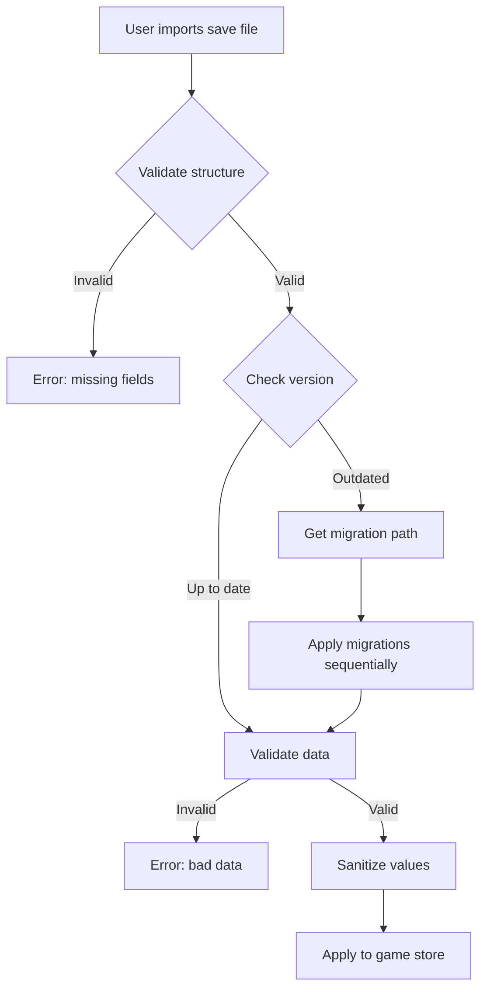

# TECH004: Save Migration Framework

**Status:** Implemented  
**PRs:** #99, #100, #101  
**Last updated:** 2025-12-31

## Overview

NanoBotsIdle uses a versioned save schema with an automatic migration framework to ensure backward compatibility as the game state evolves.

## Save Format

All saves follow a consistent envelope structure:

```typescript
interface SaveFile {
  version: number;  // Schema version (currently 2)
  date: string;     // ISO timestamp of save
  data: GameData;   // Actual game state
}
```

## Migration Architecture

### Components

| File | Purpose |
|------|---------|
| `src/utils/migrations/types.ts` | Core types and `CURRENT_SAVE_VERSION` |
| `src/utils/migrations/registry.ts` | Migration execution logic |
| `src/utils/migrations/validation.ts` | Structure and data validation |
| `src/utils/migrations/v1-to-v2.ts` | Example migration |
| `src/utils/migrations/README.md` | Developer guide |

### Migration Flow



### Adding a New Migration

1. **Update version** in `types.ts`:
   ```typescript
   export const CURRENT_SAVE_VERSION = 3;
   ```

2. **Create migration file** (`v2-to-v3.ts`):
   ```typescript
   export const migrateV2ToV3: Migration = {
     fromVersion: 2,
     toVersion: 3,
     description: "Add new field",
     migrate: (data) => ({ ...data, newField: defaultValue }),
   };
   ```

3. **Register** in `registry.ts`

4. **Add tests and fixtures**

## Validation & Sanitization

### Structure Validation
- Checks `version`, `date`, and `data` fields exist
- Validates types (number, string, object)
- Warns about future versions (encourages app updates)

### Data Validation
- Checks all game state fields are correct types
- Warns about out-of-range values
- **Detects unknown/future fields** and warns about forward compatibility

### Sanitization
- Credits: clamp to ≥ 0
- Prestige level: clamp to ≥ 1
- Drone count: clamp to ≥ 1
- Upgrade levels: clamp to ≥ 1
- **Filters unknown fields** to maintain schema integrity

### Forward Compatibility

When importing saves from future versions:
1. **Version Warning**: Alerts user that save is from a newer app version
2. **Unknown Field Detection**: Identifies fields not in current schema
3. **Data Preservation**: Sanitization keeps known fields, filters unknown ones
4. **User Guidance**: Clear messages suggest updating the app

Example warnings:
```
Save file version (v3) is newer than this app (v2).
Some features may not work correctly. Please update the app.

Save contains unknown fields that may be from a future version: newFeature, advancedSystem.
These fields will be ignored. Consider updating the app to preserve all data.
```

## Error Handling

Clear, actionable error messages:

- `Save file missing required 'version' field`
- `Field 'credits' must be a finite number, got: string`
- `Warning: Save file version (v99) is newer than this app (v2)`

## Testing

Comprehensive test coverage in:
- `tests/save-migrations.test.ts` — migration logic and transformations
- `tests/save-validation.test.ts` — validation rules and error messages
- `tests/save-roundtrip.test.ts` — full import/export cycles with fixtures
- `tests/save-migration-edge-cases.test.ts` — edge cases, forward/backward compatibility

Fixtures in `tests/fixtures/saves/`:
- **Valid saves**: `valid-v1.json`, `valid-v2.json`, `minimal-v1.json`
- **Edge cases**: `edge-case-empty-v1.json`, `edge-case-extreme-values-v2.json`, `edge-case-negative-values-v1.json`
- **Invalid saves**: `invalid-no-version.json`, `invalid-no-data.json`, `invalid-bad-types.json`
- **Future compatibility**: `future-version.json`, `future-v3-with-unknown-fields.json`, `future-v10-minimal.json`

### Test Coverage

- ✅ Empty data objects with defaults
- ✅ Missing optional fields
- ✅ Negative and extreme values
- ✅ Invalid type detection
- ✅ Future version detection and warnings
- ✅ Unknown field detection and filtering
- ✅ Migration chain integrity
- ✅ Roundtrip data preservation
- ✅ Forward and backward compatibility

## Related

- `MIGRATION_SUMMARY.md` — detailed implementation notes
- `src/store.ts` — uses current version for exports
- `src/utils/saveUtils.ts` — import/export utilities
