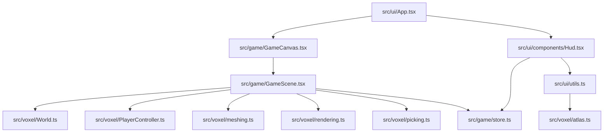

# DESIGN001 - Runtime architecture and key interfaces

## Summary

This design document describes the current runtime architecture for NanoBots Idle: how the render loop, voxel engine, and UI state collaborate.

## Component diagram

## Key runtime loop

- `GameScene` owns a long-lived `World` created via `useMemo`.
- Each frame it performs streaming, rebuild, mesh sync, and player updates.

Bounded work is a deliberate design choice:

- CPU rebuild cap: `World.rebuildDirtyChunks()` (`maxPerFrame = 4`)
- GPU swap cap: `createChunkMeshes().sync()` (`maxPerFrame = 6`)

## Public-ish interfaces (code landmarks)

### World

File: `src/voxel/World.ts`

- `new World({ seed, viewDistanceChunks, chunkSize })`
- `world.ensureChunksAround(wx, wz)`
- `world.pruneFarChunks(wx, wz)`
- `world.getBlock(wx, wy, wz)`
- `world.setBlock(wx, wy, wz, id)`
- `world.markDirtyAt(wx, wy, wz)`
- `world.rebuildDirtyChunks()`

### Player controller

File: `src/voxel/PlayerController.ts`

- Owns player position/velocity and applies physics + AABB collisions.
- Handles keyboard state + mouse look under pointer lock.

### Picking

File: `src/voxel/picking.ts`

- `pickBlockDDA(world, origin, direction, maxDist)` returns `BlockHit | null`.
- Currently treats `Water` as non-hittable.

### UI state (Zustand)

File: `src/game/store.ts`

- Intended to store UI/light state only: hotbar/inventory/stats/target, pointer lock request.
- Heavy objects (`World`, `THREE.*`) are intentionally excluded.

## Invariants checklist

- `BlockId` enum values match `BLOCKS` indices.
- `tilesPerRow = 16` matches atlas + mesher + UI.
- World edits call both `setBlock` and `markDirtyAt`.
- Keep per-frame caps unless replaced with an equivalent bounded strategy.
