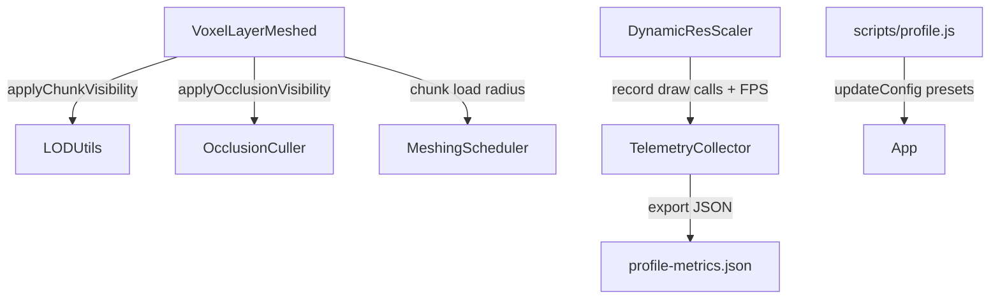

# DESIGN010: Progressive LOD + Occlusion Path + Benchmark Scene

## Overview

Add a progressive (coarse-first) LOD transition for meshed chunks, wire the existing occlusion culler into the meshed render loop behind config flags, and introduce a benchmark scene preset plus telemetry draw-call metrics so profiling can report FPS and draw calls for heavy scenes.

## Architecture



### Components

- **LOD Utils**: Adds progressive LOD resolution that delays high-LOD upgrades after visibility changes.
- **VoxelLayerMeshed**: Uses config-driven chunk ranges, applies occlusion culling when enabled, and forwards progressive LOD options.
- **TelemetryCollector**: Tracks draw-call stats alongside FPS/frame-time metrics.
- **Profiling script**: Can enable benchmark preset and reads draw-call metrics.

## Data Flow

1. `VoxelLayerMeshed` computes frustum + distance-based LOD with `applyChunkVisibility`.
2. `applyChunkVisibility` resolves the actual LOD using progressive rules when enabled.
3. `VoxelLayerMeshed` runs `OcclusionCuller.update` and `applyOcclusionVisibility` when occlusion is enabled.
4. `DynamicResScaler` records FPS, frame time, and draw calls to `TelemetryCollector`.
5. `scripts/profile.js` triggers benchmark preset config and captures telemetry snapshots that include draw-call stats.

## Interfaces

### Config (Render)

```ts
render.voxels.lod.progressive: {
  enabled: boolean;
  refineDelayFrames: number;
}

render.voxels.chunkLoad: {
  initialRadius: number;
  initialDims: 2 | 3;
  activeRadius: number;
  activeDims: 2 | 3;
}
```

### LOD Utilities

```ts
export type LodProgressiveConfig = {
  enabled: boolean;
  refineDelayFrames: number;
};

export const resolveProgressiveLod: (
  mesh: Mesh,
  desired: LodLevel,
  config: LodProgressiveConfig,
) => LodLevel;
```

### Telemetry

```ts
telemetry.drawCalls: {
  current: number;
  avg: number;
  min: number;
  max: number;
}
```

## Data Models

```ts
mesh.userData.lodTarget?: LodLevel;
mesh.userData.lodRefineFrames?: number;
```

## Error Handling Matrix

| Failure Mode | Detection | Response |
| --- | --- | --- |
| WebGL2 unavailable | `renderer.getContext()` not WebGL2 | Use no-op occlusion culler (existing behavior). |
| Missing low LOD geometry | `mesh.userData.lodGeometries.low` undefined | Skip progressive delay and use high LOD immediately. |
| Invalid benchmark config (zero radius) | Config validation in code path | Clamp to minimum of 1 in use or rely on defaults. |
| Telemetry disabled | `TelemetryCollector.isEnabled()` false | Skip metric recording. |

## Testing Strategy

- **Unit**: `resolveProgressiveLod` delays high-LOD promotion; draw-call telemetry records samples.
- **Integration**: `applyChunkVisibility` with progressive config applies low then high; occlusion visibility still hides occluded meshes.
- **Perf/benchmark**: `scripts/profile.js` emits draw-call stats in aggregate JSON.

## Implementation Plan

1. Add config schema for progressive LOD + chunk load ranges.
2. Implement `resolveProgressiveLod` and integrate into `applyChunkVisibility`.
3. Wire occlusion culler into `VoxelLayerMeshed` with config.
4. Extend telemetry with draw-call stats and record in `DynamicResScaler`.
5. Update profiling script to emit draw-call metrics and accept benchmark preset.
6. Add tests for progressive LOD, telemetry draw calls, and chunk load config usage.
